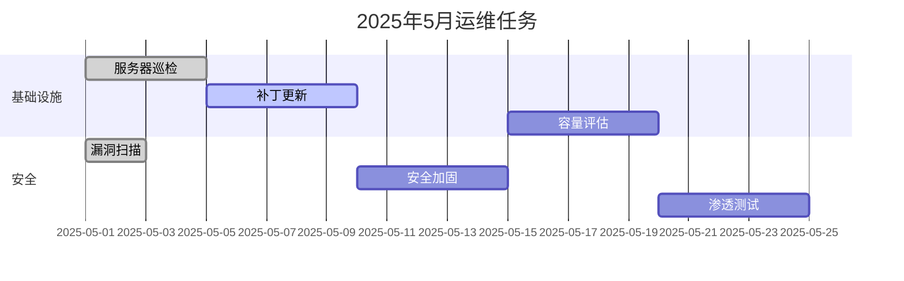

_适用于 PowerShell 5.1 及以上版本（Windows）_

运维人员经常需要将系统指标、日志统计等数据以图表形式呈现，用于周报、容量规划或故障分析。虽然 Excel 和 Grafana 是常见的可视化工具，但 PowerShell 本身也具备生成图表的能力——通过 .NET 的 `System.Windows.Forms.DataVisualization` 命名空间或导出为 HTML/CSV 交由外部工具渲染，都能快速将数据转化为直观的图形。

本文将介绍如何使用 PowerShell 生成柱状图、折线图、饼图，以及如何将图表嵌入自动化报告。

<!-- more -->

## 使用 .NET Chart 控件生成图表

Windows 上的 PowerShell 可以直接调用 .NET 的 Chart 控件生成图片。这个控件功能丰富，支持柱状图、折线图、饼图、散点图等多种图表类型。

```powershell
# 加载 Chart 程序集
Add-Type -AssemblyName System.Windows.Forms
Add-Type -AssemblyName System.Windows.Forms.DataVisualization

# 创建图表对象
$chart = New-Object System.Windows.Forms.DataVisualization.Charting.Chart
$chart.Width = 800
$chart.Height = 500
$chart.BackColor = [System.Drawing.Color]::White

# 创建图表区域
$chartArea = New-Object System.Windows.Forms.DataVisualization.Charting.ChartArea
$chartArea.Name = "MainArea"
$chartArea.AxisX.Title = "服务器"
$chartArea.AxisY.Title = "CPU 使用率 (%)"
$chartArea.AxisY.Minimum = 0
$chartArea.AxisY.Maximum = 100
$chart.ChartAreas.Add($chartArea)

# 添加数据
$servers = @(
    @{ Name = 'WEB-01'; CPU = 72.5 }
    @{ Name = 'WEB-02'; CPU = 45.3 }
    @{ Name = 'DB-01';  CPU = 89.1 }
    @{ Name = 'DB-02';  CPU = 63.8 }
    @{ Name = 'APP-01'; CPU = 34.2 }
    @{ Name = 'APP-02'; CPU = 55.7 }
)

$series = New-Object System.Windows.Forms.DataVisualization.Charting.Series
$series.Name = "CPU使用率"
$series.ChartType = [System.Windows.Forms.DataVisualization.Charting.SeriesChartType]::Column
$series.Color = [System.Drawing.Color]::SteelBlue
$series.IsValueShownAsLabel = $true

foreach ($srv in $servers) {
    $series.Points.AddXY($srv.Name, $srv.CPU) | Out-Null
}

$chart.Series.Add($series)

# 添加标题
$title = New-Object System.Windows.Forms.DataVisualization.Charting.Title
$title.Text = "服务器 CPU 使用率监控"
$title.Font = New-Object System.Drawing.Font("Microsoft YaHei", 14, [System.Drawing.FontStyle]::Bold)
$chart.Titles.Add($title)

# 保存为图片
$outputPath = "C:\Reports\cpu_usage.png"
$chart.SaveImage($outputPath, [System.Windows.Forms.DataVisualization.Charting.ChartImageFormat]::Png)
Write-Host "图表已保存到：$outputPath" -ForegroundColor Green
```

执行结果示例：

```
图表已保存到：C:\Reports\cpu_usage.png
```

## 生成折线图展示趋势

折线图适合展示时间序列数据，如 CPU 使用率趋势、内存变化等：

```powershell
Add-Type -AssemblyName System.Windows.Forms.DataVisualization

$chart = New-Object System.Windows.Forms.DataVisualization.Charting.Chart
$chart.Width = 900
$chart.Height = 500
$chart.BackColor = [System.Drawing.Color]::White

$chartArea = New-Object System.Windows.Forms.DataVisualization.Charting.ChartArea
$chartArea.Name = "TrendArea"
$chartArea.AxisX.Title = "时间"
$chartArea.AxisY.Title = "使用率 (%)"
$chartArea.AxisY.Minimum = 0
$chartArea.AxisY.Maximum = 100
$chart.ChartAreas.Add($chartArea)

# 模拟 24 小时内存使用数据
$hours = 0..23
$memUsage = @(42, 40, 38, 35, 33, 32, 45, 58, 67, 72, 75, 73,
              70, 68, 71, 74, 78, 76, 65, 58, 52, 48, 45, 43)

$series = New-Object System.Windows.Forms.DataVisualization.Charting.Series
$series.Name = "内存使用率"
$series.ChartType = [System.Windows.Forms.DataVisualization.Charting.SeriesChartType]::Line
$series.Color = [System.Drawing.Color]::OrangeRed
$series.BorderWidth = 3
$series.IsValueShownAsLabel = $false

for ($i = 0; $i -lt $hours.Count; $i++) {
    $series.Points.AddXY("$($hours[$i]):00", $memUsage[$i]) | Out-Null
}

$chart.Series.Add($series)

$title = New-Object System.Windows.Forms.DataVisualization.Charting.Title
$title.Text = "24 小时内存使用率趋势"
$title.Font = New-Object System.Drawing.Font("Microsoft YaHei", 14, [System.Drawing.FontStyle]::Bold)
$chart.Titles.Add($title)

$chart.SaveImage("C:\Reports\memory_trend.png", "Png")
Write-Host "折线图已保存" -ForegroundColor Green
```

执行结果示例：

```
折线图已保存
```

## 生成饼图展示占比

饼图适合展示各部分占总体的比例，如磁盘空间分配、服务状态分布等：

```powershell
Add-Type -AssemblyName System.Windows.Forms.DataVisualization

$chart = New-Object System.Windows.Forms.DataVisualization.Charting.Chart
$chart.Width = 700
$chart.Height = 500
$chart.BackColor = [System.Drawing.Color]::White

$chartArea = New-Object System.Windows.Forms.DataVisualization.Charting.ChartArea
$chartArea.Name = "PieArea"
$chart.ChartAreas.Add($chartArea)

# 磁盘空间数据
$diskData = @(
    @{ Label = '系统文件'; Size = 85.2 }
    @{ Label = '应用程序'; Size = 120.5 }
    @{ Label = '用户数据'; Size = 156.3 }
    @{ Label = '日志文件'; Size = 42.8 }
    @{ Label = '可用空间'; Size = 191.6 }
)

$series = New-Object System.Windows.Forms.DataVisualization.Charting.Series
$series.Name = "磁盘空间"
$series.ChartType = [System.Windows.Forms.DataVisualization.Charting.SeriesChartType]::Pie
$series.IsValueShownAsLabel = $true
$series.LabelFormat = "{0} GB"

$colors = @(
    [System.Drawing.Color]::SteelBlue,
    [System.Drawing.Color]::Orange,
    [System.Drawing.Color]::Green,
    [System.Drawing.Color]::Red,
    [System.Drawing.Color]::LightGray
)

for ($i = 0; $i -lt $diskData.Count; $i++) {
    $pointIndex = $series.Points.AddXY($diskData[$i].Label, $diskData[$i].Size)
    $series.Points[$pointIndex].Color = $colors[$i]
}

$chart.Series.Add($series)

$title = New-Object System.Windows.Forms.DataVisualization.Charting.Title
$title.Text = "磁盘空间分配（C盘 596 GB）"
$title.Font = New-Object System.Drawing.Font("Microsoft YaHei", 14, [System.Drawing.FontStyle]::Bold)
$chart.Titles.Add($title)

# 添加图例
$legend = New-Object System.Windows.Forms.DataVisualization.Charting.Legend
$legend.Name = "Default"
$chart.Legends.Add($legend)
$series.Legend = "Default"

$chart.SaveImage("C:\Reports\disk_usage_pie.png", "Png")
Write-Host "饼图已保存" -ForegroundColor Green
```

执行结果示例：

```
饼图已保存
```

## 生成 HTML 报告

在实际运维中，将数据导出为 HTML 格式更便于分享和查看。结合 Chart.js 或简单的 HTML 表格，可以创建美观的自动化报告：

```powershell
function New-ServerHealthReport {
    <#
    .SYNOPSIS
    生成服务器健康状态 HTML 报告
    #>
    [CmdletBinding()]
    param(
        [string]$OutputPath = "C:\Reports\ServerHealth.html"
    )

    # 采集数据
    $os = Get-CimInstance -ClassName Win32_OperatingSystem
    $cpu = Get-CimInstance -ClassName Win32_Processor |
        Select-Object -First 1
    $disks = Get-CimInstance -ClassName Win32_LogicalDisk -Filter "DriveType=3"
    $topProcesses = Get-Process |
        Sort-Object WorkingSet64 -Descending |
        Select-Object -First 10 Name, Id,
            @{N='内存MB'; E={[math]::Round($_.WorkingSet64/1MB,1)}}

    $totalRam = [math]::Round($os.TotalVisibleMemorySize / 1MB, 2)
    $freeRam = [math]::Round($os.FreePhysicalMemory / 1MB, 2)
    $usedRamPct = [math]::Round(($totalRam - $freeRam) / $totalRam * 100, 1)

    # 生成 HTML
    $html = @"
<!DOCTYPE html>
<html lang="zh-CN">
<head>
    <meta charset="UTF-8">
    <title>服务器健康报告 - $($os.CSName)</title>
    <style>
        body { font-family: 'Segoe UI', sans-serif; margin: 20px; background: #f5f5f5; }
        .card { background: white; border-radius: 8px; padding: 20px; margin: 10px 0;
                 box-shadow: 0 2px 4px rgba(0,0,0,0.1); }
        h1 { color: #333; } h2 { color: #555; border-bottom: 2px solid #0078d4; padding-bottom: 8px; }
        table { width: 100%; border-collapse: collapse; margin: 10px 0; }
        th { background: #0078d4; color: white; padding: 10px; text-align: left; }
        td { padding: 8px 10px; border-bottom: 1px solid #ddd; }
        tr:hover { background: #f0f8ff; }
        .metric { display: inline-block; min-width: 150px; margin: 10px 20px; }
        .metric-value { font-size: 28px; font-weight: bold; color: #0078d4; }
        .metric-label { font-size: 12px; color: #666; }
        .bar { height: 20px; background: #e0e0e0; border-radius: 4px; overflow: hidden; }
        .bar-fill { height: 100%; border-radius: 4px; }
        .warning { background: #ff9800; } .good { background: #4caf50; } .danger { background: #f44336; }
        .timestamp { color: #999; font-size: 12px; }
    </style>
</head>
<body>
    <h1>服务器健康报告</h1>
    <p class="timestamp">生成时间：$(Get-Date -Format 'yyyy-MM-dd HH:mm:ss') | 计算机：$($os.CSName)</p>

    <div class="card">
        <h2>系统概览</h2>
        <div class="metric">
            <div class="metric-value">$usedRamPct%</div>
            <div class="metric-label">内存使用率</div>
        </div>
        <div class="metric">
            <div class="metric-value">$($cpu.LoadPercentage)%</div>
            <div class="metric-label">CPU 使用率</div>
        </div>
        <div class="metric">
            <div class="metric-value">$freeRam GB</div>
            <div class="metric-label">可用内存</div>
        </div>
        <div class="metric">
            <div class="metric-value">$totalRam GB</div>
            <div class="metric-label">总内存</div>
        </div>
    </div>

    <div class="card">
        <h2>磁盘状态</h2>
        <table>
            <tr><th>驱动器</th><th>文件系统</th><th>总容量</th><th>已使用</th><th>可用</th><th>使用率</th></tr>
"@

    foreach ($disk in $disks) {
        $totalGB = [math]::Round($disk.Size / 1GB, 2)
        $freeGB = [math]::Round($disk.FreeSpace / 1GB, 2)
        $usedGB = [math]::Round(($disk.Size - $disk.FreeSpace) / 1GB, 2)
        $usedPct = [math]::Round(($disk.Size - $disk.FreeSpace) / $disk.Size * 100, 1)
        $barClass = if ($usedPct -gt 90) { "danger" } elseif ($usedPct -gt 70) { "warning" } else { "good" }

        $html += @"
            <tr>
                <td>$($disk.DeviceID)</td>
                <td>$($disk.FileSystem)</td>
                <td>${totalGB} GB</td>
                <td>${usedGB} GB</td>
                <td>${freeGB} GB</td>
                <td>
                    <div class="bar"><div class="bar-fill $barClass" style="width:$usedPct%"></div></div>
                    $usedPct%
                </td>
            </tr>
"@
    }

    $html += @"
        </table>
    </div>

    <div class="card">
        <h2>内存占用 Top 10 进程</h2>
        <table>
            <tr><th>进程名</th><th>PID</th><th>内存 (MB)</th></tr>
"@

    foreach ($proc in $topProcesses) {
        $html += "            <tr><td>$($proc.Name)</td><td>$($proc.Id)</td><td>$($proc.内存MB)</td></tr>`n"
    }

    $html += @"
        </table>
    </div>
</body>
</html>
"@

    $html | Out-File -FilePath $OutputPath -Encoding UTF8
    Write-Host "HTML 报告已生成：$OutputPath" -ForegroundColor Green
}

New-ServerHealthReport
```

执行结果示例：

```
HTML 报告已生成：C:\Reports\ServerHealth.html
```

> **注意**：HTML 报告可以直接在浏览器中打开，也可以通过邮件发送。结合 Windows 计划任务，可以每日自动生成并发送。

## 导出 CSV 供外部工具使用

如果需要更复杂的可视化，可以将数据导出为 CSV 格式，供 Excel、Power BI 或 Grafana 使用：

```powershell
# 采集多台服务器的性能数据并导出 CSV
$report = foreach ($day in 1..30) {
    $date = (Get-Date).AddDays(-$day)
    # 模拟数据（实际应从各服务器采集）
    [PSCustomObject]@{
        日期      = $date.ToString('yyyy-MM-dd')
        CPU平均   = [math]::Round((Get-Random -Min 20 -Max 80) + (Get-Random -Min 0 -Max 100) / 100, 2)
        内存使用率 = [math]::Round((Get-Random -Min 40 -Max 85) + (Get-Random -Min 0 -Max 100) / 100, 2)
        磁盘写入MB = [math]::Round((Get-Random -Min 100 -Max 5000) + (Get-Random -Min 0 -Max 100) / 100, 2)
        网络流量MB = [math]::Round((Get-Random -Min 500 -Max 20000) + (Get-Random -Min 0 -Max 100) / 100, 2)
    }
}

$report | Export-Csv -Path "C:\Reports\daily_metrics.csv" -NoTypeInformation -Encoding UTF8
Write-Host "已导出 $($report.Count) 天的指标数据" -ForegroundColor Green

# 也可以直接输出为 Markdown 表格（适合 GitHub/GitLab）
$report | ConvertTo-MarkdownTable | Set-Content "C:\Reports\daily_metrics.md"
```

执行结果示例：

```
已导出 30 天的指标数据
```

## 使用 Mermaid 在 Markdown 中嵌入图表

对于 Markdown 格式的报告，可以使用 Mermaid 语法嵌入流程图和甘特图，GitHub 和 GitLab 原生支持渲染：

```powershell
# 生成 Mermaid 甘特图的 Markdown 文件
$mermaid = @"
# 运维任务计划


"@

Set-Content -Path "C:\Reports\tasks_may.md" -Value $mermaid -Encoding UTF8
Write-Host "Mermaid 甘特图 Markdown 已生成" -ForegroundColor Green
```

执行结果示例：

```
Mermaid 甘特图 Markdown 已生成
```

## 注意事项

1. **Chart 控件依赖**：.NET Chart 控件需要 Windows 桌面环境，在 Server Core 或 Linux 上不可用。跨平台场景建议使用 HTML/CSV 导出方式
2. **图片分辨率**：生产环境中建议将图表尺寸设为 1200x600 以上，确保在高分辨率显示器上清晰
3. **中文字体**：Chart 控件中显示中文需要指定支持中文的字体（如"Microsoft YaHei"），否则可能显示方块
4. **HTML 报告编码**：生成 HTML 文件时务必使用 UTF-8 编码，并在 `<head>` 中声明 `<meta charset="UTF-8">`
5. **自动化调度**：结合 Windows 计划任务或 PowerShell 隐式远程，可以实现每日自动采集数据并生成报告
6. **大数据量**：当数据点超过数千时，.NET Chart 控件的性能会下降，建议对时间序列数据进行采样聚合后再绘图
